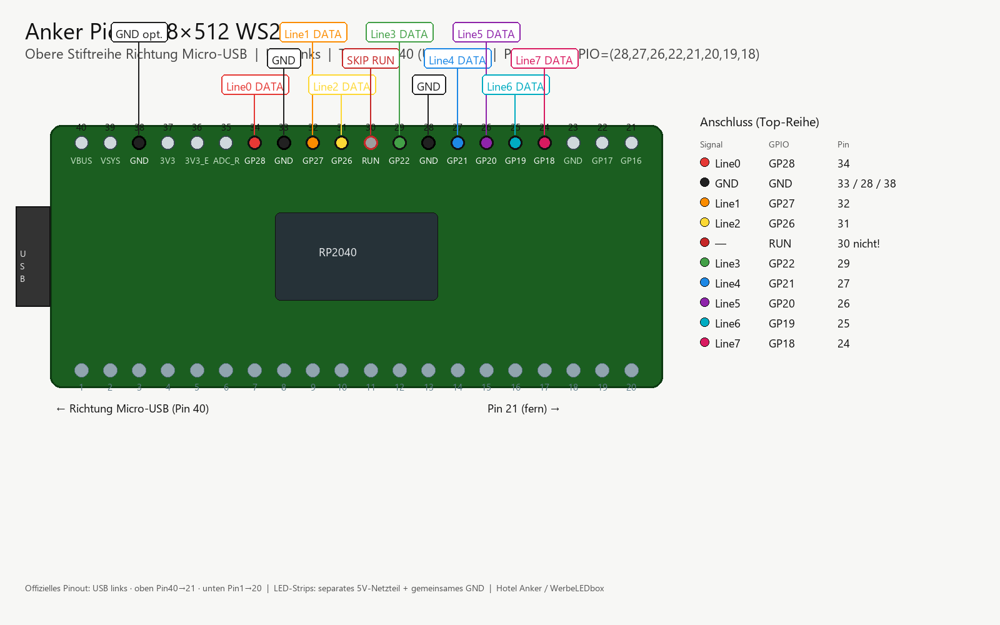

# Anker Pico — 4-line WS2812 receiver

Attached to **AnkerPI02** (Pi 4) via USB:

| Field | Value |
|--------|--------|
| Host | `AnkerPI02` / `192.168.8.106` |
| Device | `/dev/ttyACM0` |
| USB | `VID_2E8A` / `PID_0005` (MicroPython Board) |
| Serial | `e66098f29b454b32` |
| Board | **Raspberry Pi Pico** (RP2040, **kein WLAN**) |
| Firmware | MicroPython **v1.28.0** + 4-line USB receiver |

Empfang: **USB CDC** vom Pi 4 (kein Pico W). Docs: [`../docs/ANKERPI02.md`](../docs/ANKERPI02.md).

## Goal

Receive finished RGB stripes and push **4× PIO** WS2812 lines @ up to **25 fps**.

| Mode | When |
|------|------|
| **USB CDC frames** | Always (dev / plain Pico) |
| **UDP WiFi** | Pico W / Pico 2 W only |

Default geometry: `N_LED=1024` per line, `N_LINES=4` → 12 288 B/frame ≈ 2.5 Mbit/s @ 25 fps.

## Pins (data out)

## Pins (data out) — TOP row toward Micro-USB

USB links. Obere Stiftreihe links→rechts = Pin **40 → 21**.  
Anschlussblock Richtung USB: Pins **24–34** (8× DATA + GND).

| Line | GPIO | Phys. Pin |
|------|------|-----------|
| 0 | **GP28** | **34** |
| 1 | **GP27** | **32** |
| 2 | **GP26** | **31** |
| GND | GND | **33** / **28** / **38** |
| 3 | **GP22** | **29** |
| — | RUN | **30** nicht nutzen |
| 4 | **GP21** | **27** |
| 5 | **GP20** | **26** |
| 6 | **GP19** | **25** |
| 7 | **GP18** | **24** |

`N_LED=512`, `N_LINES=8`.



Pico W: do **not** use GP23–GP25 (wireless). Plain Pico (AnkerPI02): USB-only receiver.

## Flash MicroPython (BOOTSEL)

1. Unplug USB.
2. Hold **BOOTSEL**, plug USB back in, release.
3. Drive `RPI-RP2` appears.
4. From repo root (PowerShell):

```powershell
pwsh -File WerbeLEDbox-CountDown\pico\scripts\flash_micropython.ps1
```

Script reads `INFO_UF2.TXT`, copies the matching UF2 from `pico/firmware/`, then waits for COM and deploys `pico/src/*.py`.

Manual: copy `pico/firmware/RPI_PICO-v1.28.0.uf2` or `RPI_PICO_W-v1.28.0.uf2` onto `RPI-RP2`.

## WiFi (Pico W)

Copy `pico/src/secrets.py.example` → `pico/src/secrets.py` and set SSID/password before deploy (or edit on-device).

## Host smoke (after flash)

```powershell
py -3 WerbeLEDbox-CountDown\scripts\send_pico_stripes.py --port COM9 --fps 25 --seconds 5
# Pico W UDP:
py -3 WerbeLEDbox-CountDown\scripts\send_pico_stripes.py --udp 192.168.x.x:5005 --fps 25
```
